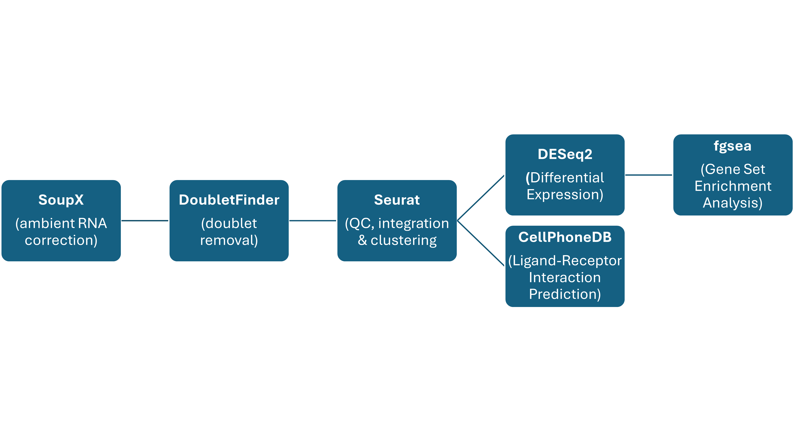

# EAU

This is a repository for data analysis code associated with **Single-cell transcriptomic analysis of retinal immune regulation and blood-retinal barrier function during experimental autoimmune uveitis**.

Most code follows standard pipelines found in documentation for the following packages:
- Seurat (https://satijalab.org/seurat/) 
- SoupX (https://github.com/constantAmateur/SoupX)
- DoubletFinder (https://github.com/chris-mcginnis-ucsf/DoubletFinder)
- CellPhoneDB (https://github.com/ventolab/CellphoneDB)
- fgsea (https://bioconductor.org/packages/release/bioc/html/fgsea.html)

## [Link to GEO submission for raw files](https://www.ncbi.nlm.nih.gov/geo/query/acc.cgi?acc=GSE241700)

## Workflow

